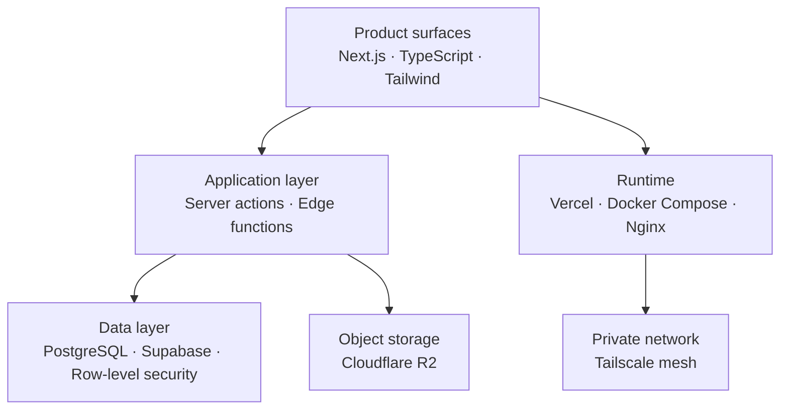

<h1 align="center">Hakim Zamri</h1>

  <b>Full-Stack Developer &nbsp;·&nbsp; Systems &amp; Infrastructure</b> 
  Building product systems at <a href="https://omnisystems.my">Omni Systems Sdn. Bhd.</a> &nbsp;·&nbsp; Malaysia

  
  
  

  
  
  
  
  
  

---

## About

IT undergraduate and full-stack developer working across the whole stack, from Next.js product surfaces down to the Docker hosts and Linux boxes they run on.

Day to day I build **structured operational systems**: multi-tenant data models, dashboards, automation pipelines, and the infrastructure that keeps them online. I care about systems that stay maintainable a year later, not demos that look good for a week.

| | |
|---|---|
| **Currently building** | [Octomations](https://app.octomations.com), a modular business operating system, and [Intrafluence](https://intrafluence.vercel.app), a brand and creator collaboration network. |
| **Working in** | TypeScript, Next.js, PostgreSQL, Supabase, Cloudflare R2, Vercel. |
| **Also running** | A self-hosted homelab of 19 containers across 9 Docker Compose projects, reachable over a Tailscale mesh, that doubles as staging and storage. |
| **Studying** | Operating systems, OOP and data structures, and low-level C/C++ alongside the product work. |

---

## How the Work Fits Together

---

## Activity

  <picture>
    <source media="(prefers-color-scheme: dark)" srcset="https://raw.githubusercontent.com/kimzam30/kimzam30/main/assets/contributions-dark.svg" />
    
  </picture>
    
  <picture>
    <source media="(prefers-color-scheme: dark)" srcset="https://raw.githubusercontent.com/kimzam30/kimzam30/main/assets/languages-dark.svg" />
    
  </picture>

Generated weekly from the GitHub API and committed to this repository, so the graphs are served by GitHub itself rather than a third-party card service.

---

## Work at Omni Systems

Product systems I design, build, and maintain. Source is private; links point to the live systems.

| System | What it is | Stack |
|---|---|---|
| **[Octomations](https://app.octomations.com)** | Modular business operating system covering structured operations, automation, analytics, and industry-specific workflows. | `Next.js` `TypeScript` `Supabase` `Postgres` |
| **[Kentra](https://kentra.app)** | Unified digital life system focused on identity, continuity, and long-term coherence across digital activity. | `Next.js` `TypeScript` `Supabase` `Vercel` |
| **[Intrafluence](https://intrafluence.vercel.app)** | Influencer and collaboration network connecting brands, creators, and audiences into one coordinated system. | `Next.js` `TypeScript` `Supabase` |
| **[omnisystems.my](https://omnisystems.my)** | Official Omni Systems website and product surface. | `Next.js` `Tailwind CSS` `Vercel` |

---

## Open Source &amp; Personal Projects

### Infrastructure &amp; Systems

| Project | Description | Stack |
|---|---|---|
| **[Homelab26](https://github.com/kimzam30/Homelab26)** | Current homelab: 19 containers across 9 Compose projects on one box, with two deliberately isolated front doors, private household services over Tailscale and a public game server plus its website behind a separate reverse proxy. Backed by a four-layer backup design. | `Docker` `Tailscale` `Nginx` `WSL2` |
| **[Remote-Dev-Setup](https://github.com/kimzam30/Remote-Dev-Setup)** | Portable, containerized VS Code Server environment for coding from any device, with pre-built Python and C++ toolchains, NAS mounts, and Tailscale access. | `Docker` `Python` `C++` `SSH` |
| **[my-linux-setup](https://github.com/kimzam30/my-linux-setup)** | Linux workstation config (Zorin OS on a Dell XPS 15 9500) covering hardware fixes, TLP power tuning, Tailscale mesh, and low-latency game streaming via Sunshine. | `Bash` `Shell` `Linux` |
| **[my-homelab-setup](https://github.com/kimzam30/my-homelab-setup)** | First-generation homelab: Homepage, FileBrowser, Pi-hole, Jellyfin, Gitea, Speedtest Tracker and Uptime Kuma behind Nginx. Superseded by Homelab26, kept as a reference build. | `Docker` `Nginx` `Self-hosted` |

### Applications &amp; Tools

| Project | Description | Stack |
|---|---|---|
| **[Nhako Tools](https://tools.nhako.com)** | 22 PDF, media, image and developer utilities that run entirely in the browser via WebAssembly. No upload step, no queue, no size cap, no backend. | `Astro` `Preact` `TypeScript` `WASM` |
| **[Nhako Search](https://search.nhako.com)** | Two-player word search with solo puzzles, a daily challenge, a 360-level path, and realtime race and co-op multiplayer. Seeded deterministic generation guarantees both players an identical board. | `Next.js` `TypeScript` `Supabase` |
| **[NhakoCapture](https://github.com/kimzam30/NhakoCapture)** | Manifest V3 screenshot extension that brings Opera's capture workflow to Chrome and Brave. Freeze the page, frame a region, annotate, copy, without leaving the tab. Zero dependencies, no build step, no telemetry. | `JavaScript` `Chrome Extension` `MV3` |
| **[Nhako-Bot](https://github.com/kimzam30/Nhako-Bot)** | Multimodal self-hosted Telegram AI assistant running Llama 3.2 via Ollama, with pgvector long-term memory and offline voice transcription through faster-whisper. | `Python` `Llama 3` `PostgreSQL` `RAG` |
| **[Nhako Beam](https://github.com/kimzam30/Nhako-beam)** | Open-source direct file transfer, peer-to-peer first with a self-hosted Docker relay as fallback. No accounts, no size caps, no cloud hop. Currently in design. | `Cross-platform` `P2P` `Docker` |
| **[Project-Nera](https://github.com/kimzam30/Project-Nera)** | Zero-dependency vanilla JS message engine: a retro terminal letter template with typewriter effects, audio, and a timed image reveal in a single HTML file. | `Vanilla JS` `CSS` `HTML` |
| **[butterfly-word-search](https://butterflywordsearch.web.app)** | Real-time multiplayer word search built as an offline-capable PWA with a server-validated game engine. Since rebuilt as Nhako Search. | `Vanilla JS` `Firebase` `PWA` |

---

## Tech Stack

  
    
  
    
  

---

## Contact

| | |
|---|---|
| **Company** | [Omni Systems Sdn. Bhd.](https://omnisystems.my) · [@omnisystemsmy](https://github.com/omnisystemsmy) |
| **Email** | [hakimzamri.omni@gmail.com](mailto:hakimzamri.omni@gmail.com) |
| **LinkedIn** | [hakim-zamri](https://www.linkedin.com/in/hakim-zamri-3686082b2) |
| **Location** | Malaysia |

Open to collaboration on systems, infrastructure, and full-stack product work.

