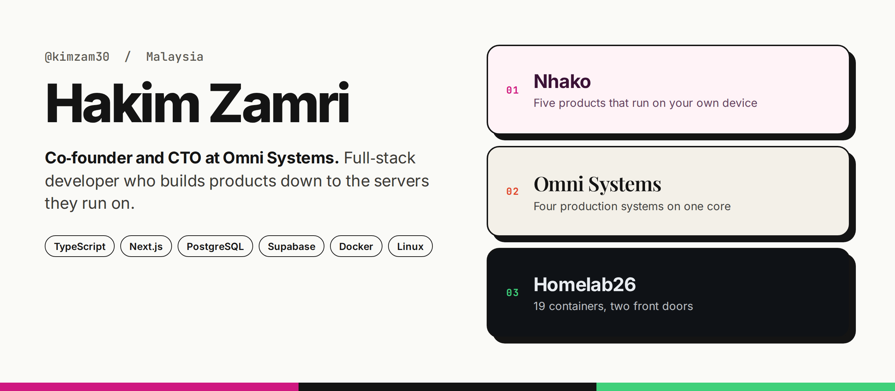
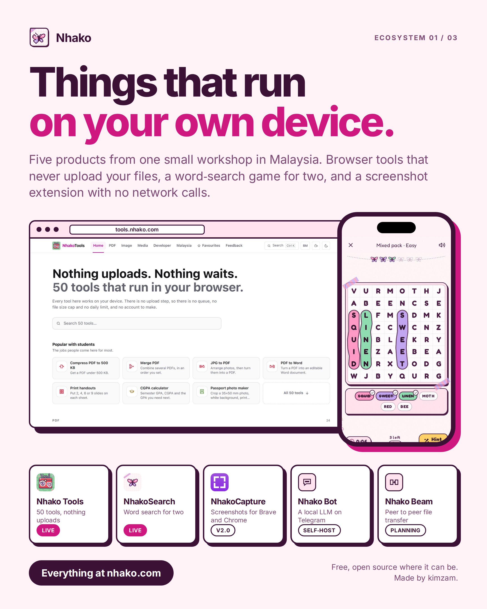
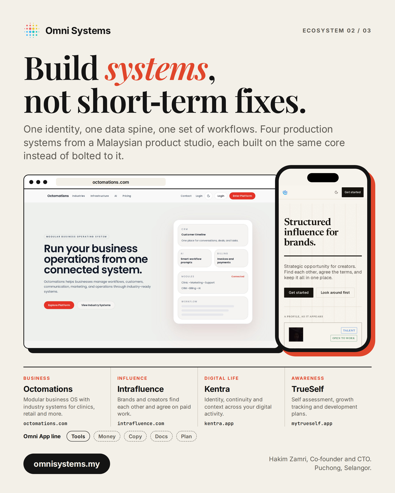
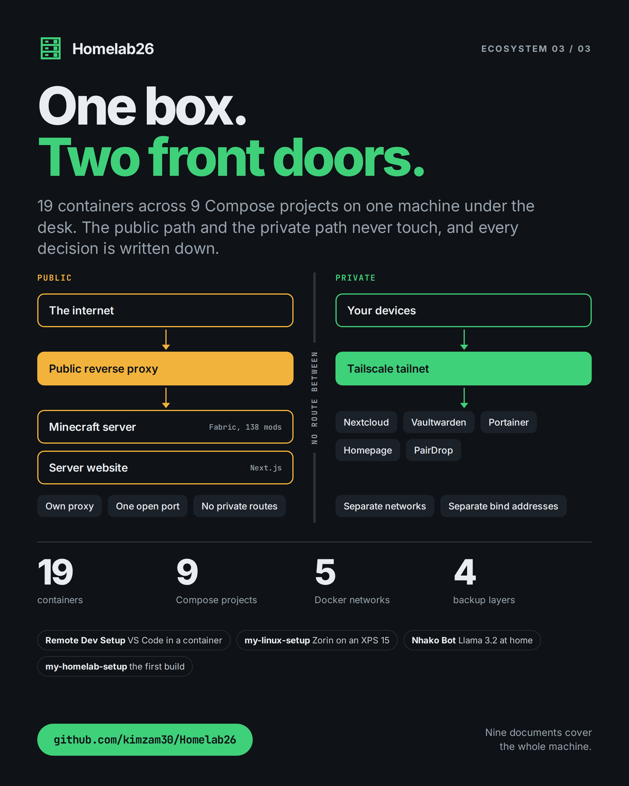
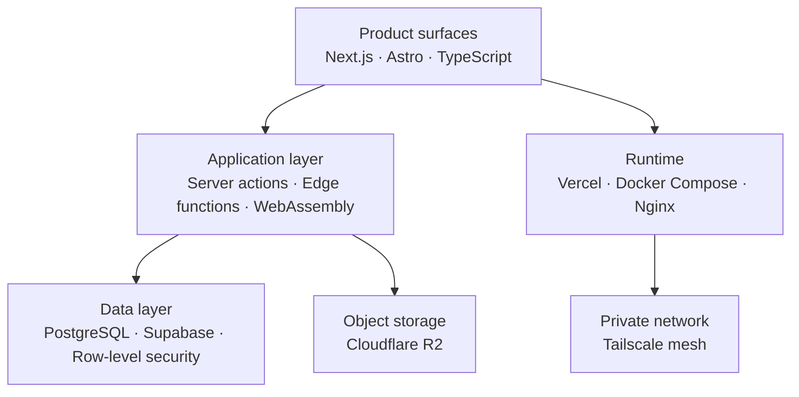

  

  
  
  
  

---

## About

Co-founder and CTO at [Omni Systems](https://www.omnisystems.my), where I lead backend architecture, data and infrastructure. IT undergraduate and full-stack developer working across the whole stack, from Next.js product surfaces down to the Docker hosts and Linux boxes they run on.

Outside the day job I run **Nhako**, a one-person workshop of products that run on your own device, and a documented homelab that doubles as staging and storage. I care about systems that stay maintainable a year later, not demos that look good for a week.

| | |
|---|---|
| **Just shipped** | [Nhako Tools 1.0](https://tools.nhako.com): 50 browser tools with no upload step, in English and Bahasa Melayu. |
| **Currently building** | [Octomations](https://www.octomations.com) and [Intrafluence](https://www.intrafluence.com) at Omni Systems, and [NhakoSearch](https://search.nhako.com) on the side. |
| **Working in** | TypeScript, Next.js, PostgreSQL, Supabase, Cloudflare R2, Vercel. |
| **Also running** | A self-hosted homelab of 19 containers across 9 Docker Compose projects, with private services reachable only over Tailscale. |
| **Studying** | Operating systems, OOP and data structures, and low-level C/C++ alongside the product work. |

---

## Three Ecosystems

  
  
  

Tap a poster for the full size. Source and render script live in <a href="launch/"><code>launch/</code></a>.

### 01 &nbsp;Nhako

Things that run on your own device. Every product lives at **[nhako.com](https://nhako.com)**.

| Product | What it is |
|---|---|
| **[Nhako Tools](https://tools.nhako.com)** Live | 50 PDF, image, media, calculator and developer tools that run entirely in the browser. Nothing uploads, so nothing waits: no queue, no size cap, no account. Installs as an app and works offline. `Astro 5` `Preact` `TypeScript` `WASM` |
| **[NhakoSearch](https://search.nhako.com)** Live | A cozy, hand-drawn word-search game for two: a daily puzzle, a 360-level path, 12 themes, and realtime race or co-op. Seeded generation guarantees both players an identical board. `Next.js 16` `Supabase` `Realtime` |
| **[NhakoCapture](https://github.com/kimzam30/NhakoCapture)** v2.0, load unpacked | Opera's one-keystroke screenshot rebuilt for Brave and Chrome. Freeze the page, frame a region, annotate, copy. Whole page to PNG or PDF, real redaction, no network calls. `JavaScript` `Manifest V3` |
| **[Nhako Bot](https://github.com/kimzam30/Nhako-Bot)** Self-host | Telegram assistant that runs on your own hardware: Llama 3.2 through Ollama, pgvector long-term memory and offline voice transcription with faster-whisper. `Python` `Ollama` `pgvector` |
| **[Nhako Beam](https://github.com/kimzam30/Nhako-beam)** Planning | Direct file transfer with no cloud, no size cap and no account. Peer to peer first, a self-hosted Docker relay only when the network leaves no other way. `Rust` `QUIC` `Tauri` |

### 02 &nbsp;Omni Systems

Four production systems on one core: one identity, one data spine, one set of workflows. Source is private; links go to the live systems.

| System | What it is |
|---|---|
| **Octomations** [octomations.com](https://www.octomations.com) | Modular business operating system with industry systems for clinics, education, retail, restaurants and more. |
| **Intrafluence** [intrafluence.com](https://www.intrafluence.com) | A structured place for brands and creators to find each other and agree on paid work, with consent before contact enforced in the database. |
| **Kentra** [kentra.app](https://kentra.app) | Unified digital life system focused on identity, continuity and long-term context across digital activity. |
| **TrueSelf** [mytrueself.app](https://mytrueself.app) | Awareness system for self assessment, growth tracking and development plans. |
| **Omni App line** [omnisystems.my](https://www.omnisystems.my) | Small single-purpose apps beside the production systems: Tools in limited release, with Money, Copy, Docs and Plan in development. The company site is the front door to all of it. |

### 03 &nbsp;Homelab and Self-Hosting

One box, two front doors. The machines under the desk and the software on them, written up so they can be rebuilt.

| Project | Description |
|---|---|
| **[Homelab26](https://github.com/kimzam30/Homelab26)** | Current homelab: 19 containers across 9 Compose projects and 5 Docker networks on one box. Private household services over Tailscale; a public Minecraft server (Fabric, 138 mods) and its website behind a separate reverse proxy with no route to anything private. Four backup layers and nine documents cover the whole machine. `Docker` `Tailscale` `restic` `WSL2` |
| **[Remote-Dev-Setup](https://github.com/kimzam30/Remote-Dev-Setup)** | Portable, containerized VS Code Server for coding from any device, with Python and C++ toolchains, NAS mounts and Tailscale access. `Docker` `Python` `C++` `SSH` |
| **[my-linux-setup](https://github.com/kimzam30/my-linux-setup)** | Zorin OS on a Dell XPS 15 9500: hardware fixes, TLP power tuning, Tailscale mesh and low-latency game streaming via Sunshine. `Bash` `Shell` `Linux` |
| **[my-homelab-setup](https://github.com/kimzam30/my-homelab-setup)** | The first homelab: Homepage, FileBrowser, Pi-hole, Jellyfin, Gitea, Speedtest Tracker and Uptime Kuma behind Nginx. Superseded by Homelab26, kept as a reference build. `Docker` `Nginx` `Self-hosted` |

### Smaller Things

| Project | Description |
|---|---|
| **[Project-Nera](https://github.com/kimzam30/Project-Nera)** | A personal letter delivered as a retro terminal session: typewriter text, music and a timed image reveal in one HTML file. `Vanilla JS` `CSS` `HTML` |
| **[butterfly-word-search](https://butterflywordsearch.web.app)** | The original realtime multiplayer word search, an offline-capable PWA with a server-validated game engine. Since rebuilt as NhakoSearch. `Vanilla JS` `Firebase` `PWA` |
| **[Study-Cplusplus-in-7-days](https://github.com/kimzam30/Study-Cplusplus-in-7-days)** | A self-directed sprint through C++ fundamentals, pointers to stacks, one topic a day, each a small program that compiles. `C++17` `OOP` |

---

## How the Work Fits Together

```mermaid
flowchart TD
    UI["Product surfaces<br/>Next.js · Astro · TypeScript"]
    APP["Application layer<br/>Server actions · Edge functions · WebAssembly"]
    DATA["Data layer<br/>PostgreSQL · Supabase · Row-level security"]
    OBJ["Object storage<br/>Cloudflare R2"]
    RUN["Runtime<br/>Vercel · Docker Compose · Nginx"]
    NET["Private network<br/>Tailscale mesh"]

    UI --> APP
    APP --> DATA
    APP --> OBJ
    UI --> RUN
    RUN --> NET
```

---

## Activity

  <picture>
    <source media="(prefers-color-scheme: dark)" srcset="https://raw.githubusercontent.com/kimzam30/kimzam30/main/assets/contributions-dark.svg" />
    
  </picture>
    
  <picture>
    <source media="(prefers-color-scheme: dark)" srcset="https://raw.githubusercontent.com/kimzam30/kimzam30/main/assets/languages-dark.svg" />
    
  </picture>

Generated weekly from the GitHub API and committed to this repository, so the graphs are served by GitHub itself rather than a third-party card service.

---

## Tech Stack

  
    
  
    
  

---

## Contact

| | |
|---|---|
| **Company** | [Omni Systems Sdn. Bhd.](https://www.omnisystems.my) · [@omnisystemsmy](https://github.com/omnisystemsmy) |
| **Workshop** | [nhako.com](https://nhako.com) |
| **Email** | [hakimzamri.omni@gmail.com](mailto:hakimzamri.omni@gmail.com) |
| **LinkedIn** | [hakim-zamri](https://www.linkedin.com/in/hakim-zamri-3686082b2) |
| **Location** | Selangor, Malaysia |

Open to collaboration on systems, infrastructure, and full-stack product work.

